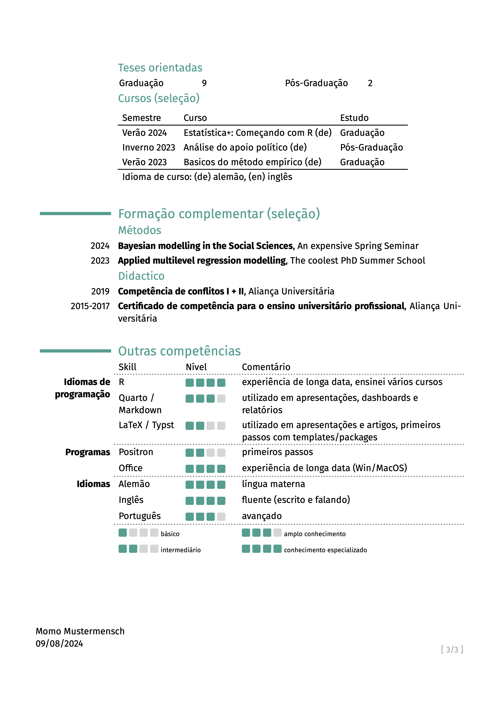

# moderner-acad-cv

This template for an academic CV serves the peculiarities of academic CVs. If you are not an academic, this template is not useful. Most of the times in academics, applicants need to show everything they have done. This makes it a bit cumbersome doing it by single entries. In addition, academics might apply to institutions around the globe, making it necessary to send translated CVs or at least translations of some parts (i.e., title of papers in different languages). 

This template serves these special needs in introducting automated sections based on indicated `yaml`-files. Furthermore, it has a simplified i18n-support by setting different headers, title etc. for different languages (by the user in the `yaml`-fields). With this template, it might be more handy to keep your CV easier on track, especially when you need in different languages, since managing a `yaml`-file is easier than checking typesetting files against each other. 

This template is influenced by LaTeX's [moderncv](https://github.com/moderncv/moderncv) and its typst translation [moderner-cv](https://github.com/DeveloperPaul123/modern-cv).

## Fonts

In this template, the use of FontAwesome icons via the [fontawesome typst package](https://typst.app/universe/package/fontawesome) is possible, as well as the icons from Academicons [use-academicons typst package](https://typst.app/universe/package/use-academicons). To use these icons properly, you need to install each fonts on your system. You can download [fontawesome here](https://fontawesome.com/download) and [academicons here](https://jpswalsh.github.io/academicons/). Both typst packages will be load by the template itself.

Furthermore, I included my favorite font [Fira Sans](https://fonts.google.com/specimen/Fira+Sans). You can download it here [here](https://fonts.google.com/specimen/Fira+Sans), or just change the font argument in `modern-acad-cv()`. 

## Usage

```typst
#import "@preview/modern-acad-cv:0.1.0": *

#show: moderner-cv.with(
  name: "Jane Doe",
  lang: "en",
  social: (
    email: "jane.doe@example.com",
    github: "jane-doe",
    linkedin: "jane-doe",
  ),
)

// ...
```

## Examples





